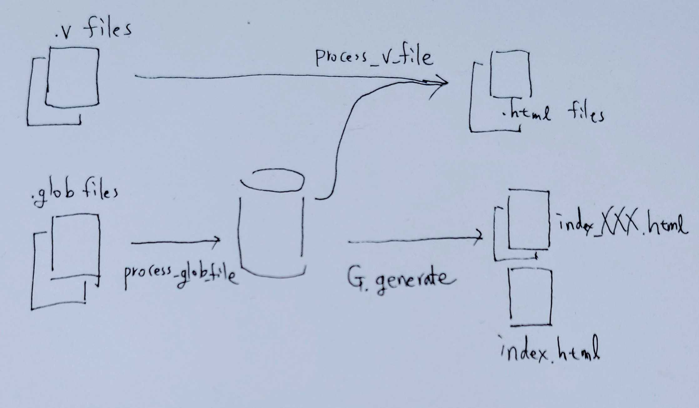

## Main data flow

 * [~process_glob_file~](https://github.com/affeldt-aist/coq2html/blob/cc7abb5e987c6028b61f1aa1163286e68dbc83b8/coq2html.mll#L690)
A glob file is a text file that contains reference information for the location information of tokens when the v-file is divided into tokens.
This process creates a table for each glob file that can look up the reference information using the location information as a key.

 * [~process_v_file~](https://github.com/affeldt-aist/coq2html/blob/cc7abb5e987c6028b61f1aa1163286e68dbc83b8/coq2html.mll#L672)
Generates html files while parsing v files.
The above-mentioned reference information table is also used to generate the html file so that the user can click on lemmas or function names to jump to the referenced destination.

 * [~Generate_index.generate~](https://github.com/affeldt-aist/coq2html/blob/cc7abb5e987c6028b61f1aa1163286e68dbc83b8/generate_index.mli#L23)

Create an index page like the one in coqdoc for each module from the reference table.

## Implementation overview

Main (OCaml) files:
- Main file, modified from the original version of coq2html:
    - [rocqnavi.mll](https://github.com/affeldt-aist/coq2html/blob/master/rocqnavi.mll)
- Added by this fork of coq2html to generate an index like coqdoc and a sidebar:
    - [generate_index.ml](https://github.com/affeldt-aist/coq2html/blob/master/generate_index.ml)
    - [generate_index.mli](https://github.com/affeldt-aist/coq2html/blob/master/generate_index.mli)

Static HTML/CSS/JavaScript files:
- [rocqnavi.header](https://github.com/affeldt-aist/coq2html/blob/master/rocqnavi.header): HTML
- [rocqnavi.footer](https://github.com/affeldt-aist/coq2html/blob/master/rocqnavi.footer): HTML
- [rocqnavi.redirect](https://github.com/affeldt-aist/coq2html/blob/master/rocqnavi.redirect): HTML
- [rocqnavi.css](https://github.com/affeldt-aist/coq2html/blob/master/rocqnavi.css): CSS
- [rocqnavi.js](https://github.com/affeldt-aist/coq2html/blob/master/rocqnavi.js): JavaScript

Dependencies (via `rocqnavi.header`):
- [markdown-it-texmath](https://github.com/goessner/markdown-it-texmath) for Markdown + LaTeX
- [Darkmode.js](https://darkmodejs.learn.uno/) for darkmode

File automatically generated from the HTML/CSS/JavaScript files by the Makefile:
- `resources.ml`: OCaml (where the HTML/CSS/JavaScript files are turned into OCaml strings)

## How markdown + TeX notation is available
## Darkmode
## How the State of the menu toggles are kept by page transitions
Save the status to localStorage property of window
